# Setting up the work evironment
 
You should have access to a Unix Shell. In the following sections we will explain how to access to a terminal/command-line or shell in the different operative systems.

## macOS users

There is an application, and you can access it with:
- Finder, go to: Applications > Utilities > Terminal.app
- Spotlight search function, write `terminal` and press <kbd>Return</kbd>.

> **Tip:** You might want to add this application to your dock for easy access.

> **NOTE:** For a Mac computer running macOS Mojave or earlier releases, the default Unix Shell is **Bash**. For a Mac computer running macOS Catalina or later releases, the default Unix Shell is **Zsh**. The default shell of your system is available via the terminal. If your machine is set up to something other than Bash, you can run it by openning a terminal and typing `bash`.

## Linux users

There are multiple Linux flavors. The default Unix Shell for Linux is usually Bash. On most version the shell is accessible running:
 
- [(Gnome) Terminal](https://help.gnome.org/users/gnome-terminal/stable/)
- [(KDE) Konsole](https://konsole.kde.org/)
- [xterm](https://en.wikipedia.org/wiki/Xterm)
- [tilix](https://gnunn1.github.io/tilix-web/)

All of them can be found via:
- the Applications menu (top or bottom left) > Utilities > Terminal
- <kbd>Super</kbd> + typing `terminal`.

> **Tip:** You might want to add this application to your dock/favorites for easy access.

> **NOTE:** If your machine is set up to use something other than Bash, you can run it by opening a terminal and typing `bash`.

## Windows users

Computers with Windows operating systems do not automatically have a Unix Shell program installed but there are several solutions available:

For beginners (explanations below):
- Using an emulator included in Git for Windows, which gives you access to both Bash shell commands and Git.
- Using a Virtual Machine with a Unix-line operative system.

For more advanced users:
- Running Bash commands on Windows with the new Bash shell command-line tools.
- Running Bash commands on a remote computer or server that already has a Unix shell. 

### Using Git for Windows

Download Git for Windows [here](https://git-scm.com/download/win)

Install Git for Windows:

- Accept the licensing
    
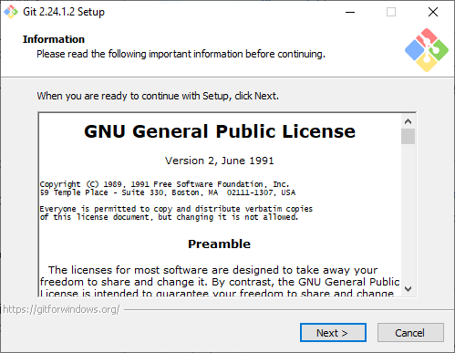

- Set up location for installation (default), click "Next".

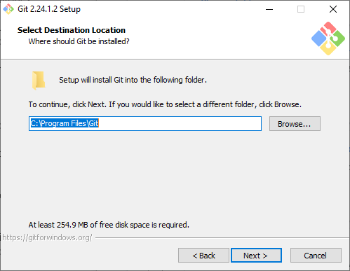

- Make sure the "Git Bash Here" option is checked, click "Next".

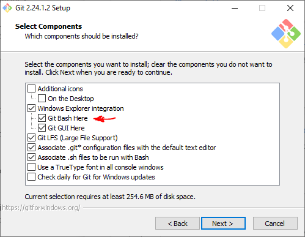

- Add "Git" folder to the Start Menu Folder, click "Next".

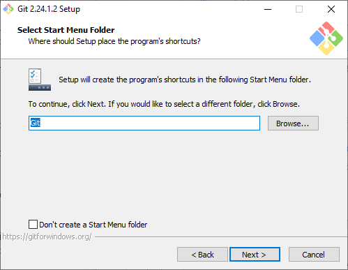

- Select default editor for Git related edits, click "Next".

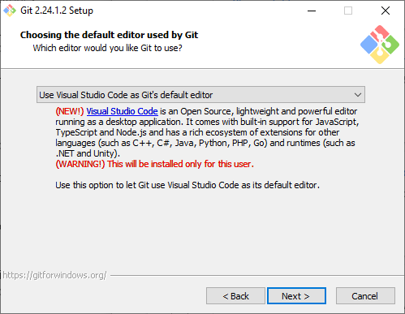

- Adjust the scope of the Unix tools included. Order from very conservative to advanced. Select, then click "Next".

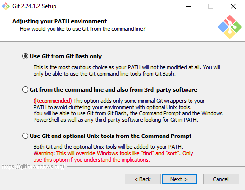

- Select SSL library (default), click "Next".

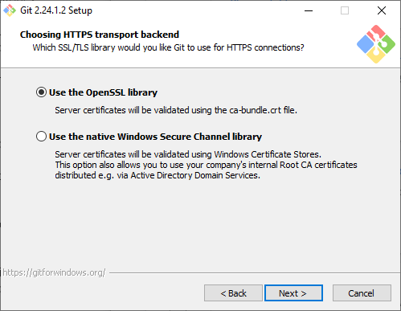

- Select how Git will handle end of lines, click "Next".

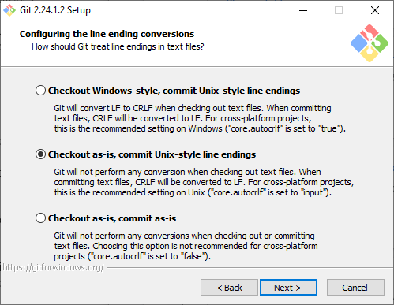

- Select terminal emulator (default), click "Next".

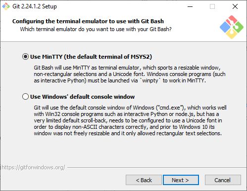

- Enable extra features (default), click "Next"; then click "Install" in the following window.

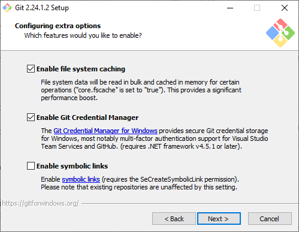

- Installation is done.

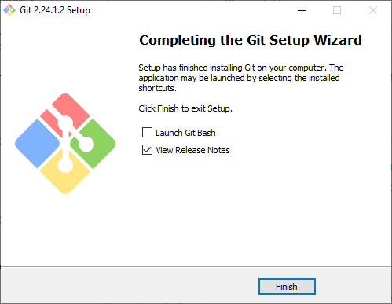

In order to be able to work with this, we will have to open the "Git Bash" application. We can do that by:
- <kbd>Super</kbd> + typing `git bash`.
- Typing `git bash` in the Windows Search bar (Toolbar bottom left)
- Going to the Start Menu > Git > Git BASH

### Using a Virtual Machine

What is a virtual machine (VM)? A VM is a software computer that, like a physical computer, runs an operating system and a set of software applications. It allows you to run one operating system (e.g. Linux) within another operating system (e.g. Windows). For our class we will use [VirtualBox](https://www.virtualbox.org/wiki/VirtualBox). 

We can download it from [here](https://download.virtualbox.org/virtualbox/6.1.0/VirtualBox-6.1.0-135406-Win.exe) and install it using all the default parameters.

In order to actually have a machine, we have to create one. For that, we have configured an image of a machine with [Ubuntu 18.04 LTS](https://ubuntu.com/download/desktop) (one of the many flavors of Linux) that can be downloaded from [here](https://drive.google.com/open?id=1vuHphvCOlGRGlOXZ6uGgv60PyGFKaZiK)(~12 GB). Once you have downloaded it, you'll need to:

- Open VirtualBox
- Click the "Import appliance" button

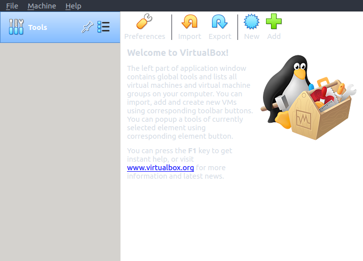

- Look for the image (*.ova fila) you just downloaded. 

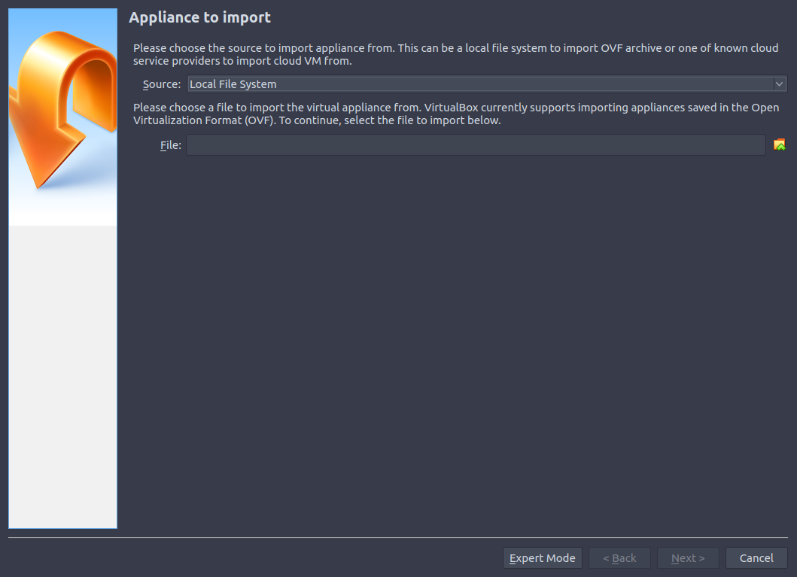

- Check the featured of the VM.

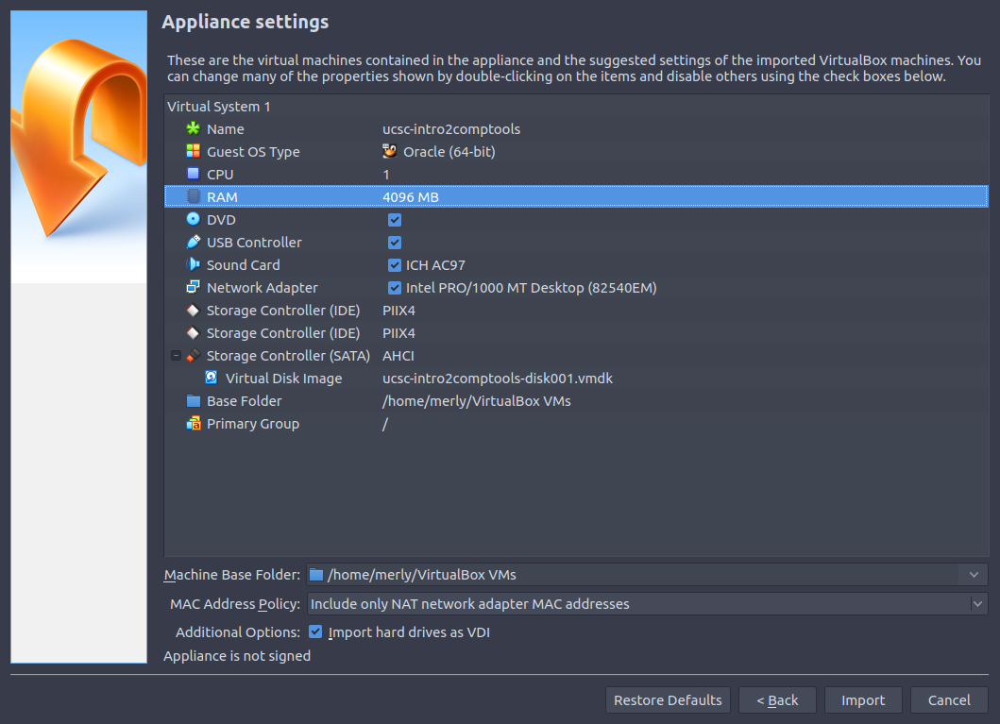

- Wait for the appliance to load.

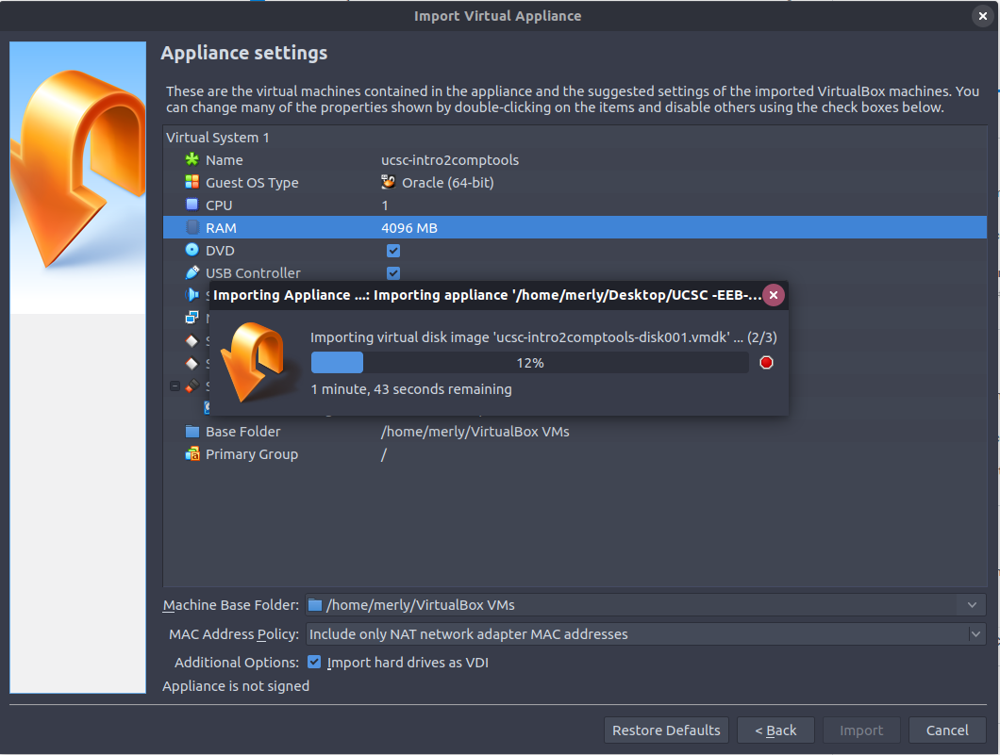

- One it is loaded you'll have a windows like this.

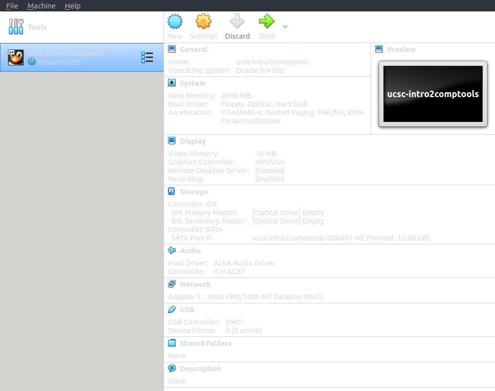

> **NOTE:** When using a VM, the software computer uses the components of the physical computer (the host/your machine) 
to be able to run. This means, that when the VM is open it will take the resources it needs, which means
that it will most likely descrease the performance (slow down) of your machine. While in processing
terms the host machine will be able to handle the VM and all the other programs you'd have open, 
but the RAM  memory won't. If the default features of the machine that we created do not allow you
to handle both your machine and the VM, you can modify the amount of RAm byt clicking the "System" tab.
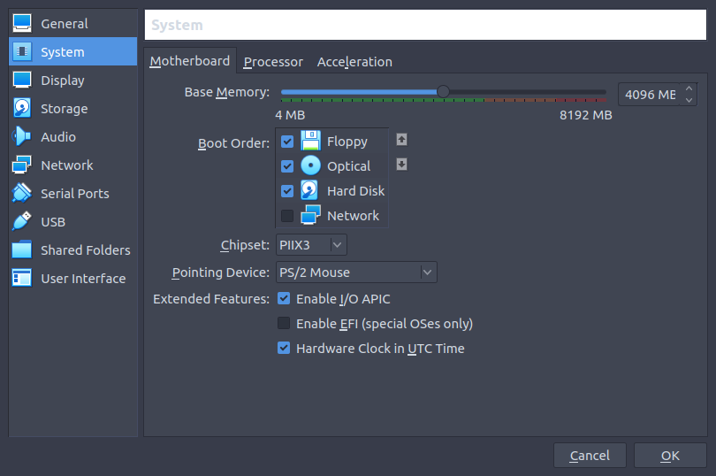

To turn on the VM, you can double click on the machine that we have imported or, select the machine, right click and then "start".

Access information:
- Username: `user`
- Hostname: `ucsc-cbb`
- Password: `ucsc2020`

This machine should have installed all the necesary software that we will be using for this course.
- [`python3`](https://www.python.org/)
- [`git`](https://git-scm.com/)
- [`BioPython`](https://biopython.org/)
- [`pandas`](https://pandas.pydata.org/)

# The Unix shell / terminal / command-line

The Unix shell is both a command-line interface (CLI) and a scripting language, allowing such repetitive tasks to be done automatically and fast. With the proper commands, the shell can repeat tasks with or without some modification as many times as we want. 

The shell is a program where users can type commands. With the shell, it’s possible to invoke complicated programs like climate modeling software or simple commands that create an empty directory with only one line of code. The most popular Unix shell is `Bash` (the **B**ourne **A**gain **SH**ell — so-called because it’s derived from a shell written by Stephen Bourne). `Bash` is the default shell on most modern implementations of Unix.

Using the shell will take some effort and some time to learn. While a graphic user interfaces (GUI) presents you with choices to select, CLI choices are not automatically presented to you, so you must learn a few commands like new vocabulary in a language you’re studying. However, unlike a spoken language, a small number of "words" (i.e. commands) gets you a long way.

The grammar of a shell allows you to combine, in an almost unlimited fashion, existing tools into powerful pipelines and handle large volumes of data automatically. Sequences of commands can be written into a script, improving the reproducibility of workflows.

In addition, the command line is often the easiest way to interact with remote machines and supercomputers. Familiarity with the shell is near essential to run a variety of specialized tools and resources including high-performance computing systems. As clusters and cloud computing systems become more popular for scientific data crunching, being able to interact with the shell is becoming a necessary skill. We can build on the command-line skills covered here to tackle a wide range of scientific questions and computational challenges.

---

[Source: the Software Carpentry, Data Carpentry, and Library Carpentry instructional material](http://swcarpentry.github.io/shell-novice/01-intro/index.html) 

*Under the Creative Commons Attribution license ([CC BY 4.0](https://creativecommons.org/licenses/by/4.0/))*

# Files and directories

Directories are the Unix equivalent of folders on a PC or Mac. They are organised in a hierarchy, so directories can have sub-directories and so on. 

*[Source: devOpsAGE](https://www.devopsage.com/file-system-hierarchy-of-linux/)*

## Structure of a pahtname

*[Source: eTutorials.org](http://etutorials.org/Linux+systems/red+hat+linux+9+professional+secrets/Part+II+Exploring+Red+Hat+Linux/Chapter+7+Red+Hat+Linux+Basics/Understanding+the+Linux+File+System/)*

If there is a file called `genome.seq` in the `dna` directory its location or full path can be
expressed as `/home/user/dna/genome.seq`. The full path can be also referred as **absolute path**.
If we are under the directory `/home/user/`, and we would like to write the **relative path** of 
the  same file, we would do it like: `dna/genome.seq` or `./dna/genome.seq`.

The location or directory that you are in is referred to as the **current working directory**.

There are some short cuts for referring to directories:
- `.`: Current directory (one full stop)
- `..`: Directory above (two full stops)
- `~`: Home directory (tilde)
- `/`: Root of the file system (like C: in Windows)
