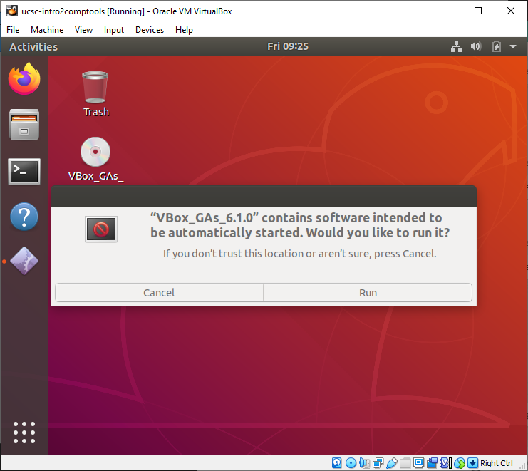
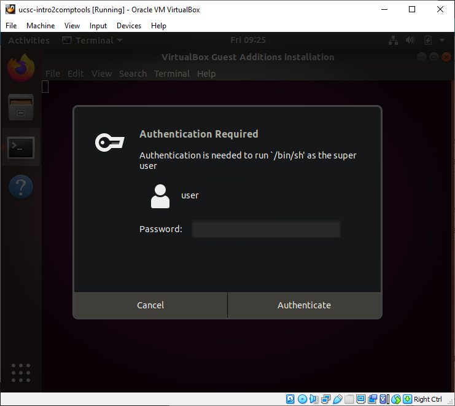

# Setting up the work evironment
 
You should have access to a Unix Shell. In the following sections we will explain how to access to a terminal/command-line or shell in the different operative systems.

## macOS users

There is an application, and you can access it with:
- Finder, go to: Applications > Utilities > Terminal.app
- Spotlight search function, write `terminal` and press <kbd>Return</kbd>.

> **Tip:** You might want to add this application to your dock for easy access.

> **NOTE:** For a Mac computer running macOS Mojave or earlier releases, the default Unix Shell is **Bash**. For a Mac computer running macOS Catalina or later releases, the default Unix Shell is **Zsh**. The default shell of your system is available via the terminal. If your machine is set up to something other than Bash, you can run it by openning a terminal and typing `bash`.

## Linux users

There are multiple Linux flavors. The default Unix Shell for Linux is usually Bash. On most version the shell is accessible running:
 
- [(Gnome) Terminal](https://help.gnome.org/users/gnome-terminal/stable/)
- [(KDE) Konsole](https://konsole.kde.org/)
- [xterm](https://en.wikipedia.org/wiki/Xterm)
- [tilix](https://gnunn1.github.io/tilix-web/)

All of them can be found via:
- the Applications menu (top or bottom left) > Utilities > Terminal
- <kbd>Super</kbd> + typing `terminal`.

> **Tip:** You might want to add this application to your dock/favorites for easy access.

> **NOTE:** If your machine is set up to use something other than Bash, you can run it by opening a terminal and typing `bash`.

## Windows users

Computers with Windows operating systems do not automatically have a Unix Shell program installed but there are several solutions available:

For beginners (explanations below):
- Using an emulator included in Git for Windows, which gives you access to both Bash shell commands and Git.
- Using a Virtual Machine with a Unix-line operative system.

For more advanced users:
- Running Bash commands on Windows with the new Bash shell command-line tools.
- Running Bash commands on a remote computer or server that already has a Unix shell. 

### Using Git for Windows

Download Git for Windows [here](https://git-scm.com/download/win).  Note that this is a project which is separate from Git itself; for more information on it, go to https://gitforwindows.org. 

Install Git for Windows:

- Accept the licensing
    

- Set up location for installation (default), click "Next".

- Make sure the "Git Bash Here" option is checked, click "Next".

- Add "Git" folder to the Start Menu Folder, click "Next".

- Select default editor for Git related edits, click "Next".

- Adjust the scope of the Unix tools included. Order from very conservative to advanced. Select, then click "Next".

- Select SSL library (default), click "Next".

- Select how Git will handle end of lines, click "Next".

- Select terminal emulator (default), click "Next".

- Enable extra features (default), click "Next"; then click "Install" in the following window.

- Installation is done.

In order to be able to work with this, we will have to open the "Git Bash" application. We can do that by:
- <kbd>Super</kbd> + typing `git bash`.
- Typing `git bash` in the Windows Search bar (Toolbar bottom left)
- Going to the Start Menu > Git > Git BASH

### Using a Virtual Machine

What is a virtual machine (VM)? A VM is a software computer that, like a physical computer, runs an operating system and a set of software applications. It allows you to run one operating system (e.g. Linux) within another operating system (e.g. Windows). For our class we will use [VirtualBox](https://www.virtualbox.org/wiki/VirtualBox). 

We can download it from [here](https://download.virtualbox.org/virtualbox/6.1.0/VirtualBox-6.1.0-135406-Win.exe) and install it using all the default parameters.

In order to actually have a machine, we have to create one. For that, we have configured an image of a machine with [Ubuntu 18.04 LTS](https://ubuntu.com/download/desktop) (one of the many flavors of Linux) that can be downloaded from [here](https://drive.google.com/open?id=1vuHphvCOlGRGlOXZ6uGgv60PyGFKaZiK)(~12 GB). Once you have downloaded it, you'll need to:

- Open VirtualBox
- Click the "Import appliance" button

- Look for the image (*.ova fila) you just downloaded. 

- Check the featured of the VM.

- Wait for the appliance to load.

- One it is loaded you'll have a windows like this.

> **NOTE:** When using a VM, the software computer uses the components of the physical computer (the host/your machine) 
to be able to run. This means, that when the VM is open it will take the resources it needs, which means
that it will most likely descrease the performance (slow down) of your machine. While in processing
terms the host machine will be able to handle the VM and all the other programs you'd have open, 
but the RAM  memory won't. If the default features of the machine that we created do not allow you
to handle both your machine and the VM, you can modify the amount of RAm byt clicking the "System" tab.

To turn on the VM, you can double click on the machine that we have imported or, select the machine, right click and then "start".

Access information:
- Username: `user`
- Hostname: `ucsc-cbb`
- Password: `ucsc2020`

This machine should have installed all the necesary software that we will be using for this course.
- [`python3`](https://www.python.org/)
- [`git`](https://git-scm.com/)
- [`BioPython`](https://biopython.org/)
- [`pandas`](https://pandas.pydata.org/)

## VirtualBox guest additions.

The features of the VM once is initialized may be a little rough. These additions consist of device drivers and system applications that optimize the guest operating system (our Ubuntu machine) for better performance and usability. 

> To know more of what these additions do,  you can check the [VirtualBox site](https://www.virtualbox.org/manual/ch04.html).

### Installation of guest additions

You don't need to download these additions, but you will need to install them. To do so, once your VM is on you will go to the toolbar on the top of the windows and go to 'Devices':

There, you then will click the option 'Inster Guest Additions CD image...', this will be like we were inserting a CD in the VM.

Once we click there, the guest OS will ask us how to handle the CD, we will then click 'Run'.

Since this is an installation of some drivers in the guest OS, we will be asked to enter the admin password. In this case, the same we use to access the VM.

It will open a window (the Terminal) and some text describing the status of the installation will appear.

When it has finished, the last line of the text will say 'Press Return to close this window...'

And so wi will press <kbd>Return</kbd>, the windows will close and we will have to restart the VM. The next time the VM is on, we will be able to adjust the size of the window, better handle the mouse and keyboard integrations, and more. 

