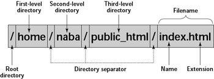

# Week one

## Before class

You should have access to the linux environment, running virtual box if you have a windows machine or native in your mac.

### Open terminal

> Add the yellow flag to the right corner of your laptop 

#### macOS users

There is an application, and you can access it with:
- Finder, go to: Applications > Utilities > Terminal.app
- Spotlight search function, write `terminal` and press <kbd>Return</kbd>.

> **Tip:** You might want to add this application to your dock for easy access.

> **NOTE:** For a Mac computer running macOS Mojave or earlier releases, the default Unix Shell is **Bash**. For a Mac computer running macOS Catalina or later releases, the default Unix Shell is **Zsh**. The default shell of your system is available via the terminal. If your machine is set up to something other than Bash, you can run it by openning a terminal and typing `bash`.

#### Linux users

There are multiple Linux flavors. The default Unix Shell for Linux is usually Bash. On most version the shell is accessible running:
 
- [(Gnome) Terminal](https://help.gnome.org/users/gnome-terminal/stable/)
- [(KDE) Konsole](https://konsole.kde.org/)
- [xterm](https://en.wikipedia.org/wiki/Xterm)
- [tilix](https://gnunn1.github.io/tilix-web/)

All of them can be found via:
- the Applications menu (top or bottom left) > Utilities > Terminal
- <kbd>Super</kbd> + typing `terminal`.

> **Tip:** You might want to add this application to your dock/favorites for easy access.

> **NOTE:** If your machine is set up to use something other than Bash, you can run it by opening a terminal and typing `bash`.
> Change your flag to green if you are good to continue 


#### Windows users

Go to [Week 00](https://github.com/merlyescalona/ucsc-eeb-intro2comptools/tree/master/week_00) for set up.

## The Unix shell / terminal / command-line

The Unix shell is both a command-line interface (CLI) and a scripting language, allowing such repetitive tasks to be done automatically and fast. With the proper commands, the shell can repeat tasks with or without some modification as many times as we want. 

The shell is a program where users can type commands. With the shell, it’s possible to invoke complicated programs like climate modeling software or simple commands that create an empty directory with only one line of code. The most popular Unix shell is `Bash` (the **B**ourne **A**gain **SH**ell — so-called because it’s derived from a shell written by Stephen Bourne). `Bash` is the default shell on most modern implementations of Unix.

Using the shell will take some effort and some time to learn. While a graphic user interfaces (GUI) presents you with choices to select, CLI choices are not automatically presented to you, so you must learn a few commands like new vocabulary in a language you’re studying. However, unlike a spoken language, a small number of "words" (i.e. commands) gets you a long way.

The grammar of a shell allows you to combine, in an almost unlimited fashion, existing tools into powerful pipelines and handle large volumes of data automatically. Sequences of commands can be written into a script, improving the reproducibility of workflows.

In addition, the command line is often the easiest way to interact with remote machines and supercomputers. Familiarity with the shell is near essential to run a variety of specialized tools and resources including high-performance computing systems. As clusters and cloud computing systems become more popular for scientific data crunching, being able to interact with the shell is becoming a necessary skill. We can build on the command-line skills covered here to tackle a wide range of scientific questions and computational challenges.

---

[Source: the Software Carpentry, Data Carpentry, and Library Carpentry instructional material](http://swcarpentry.github.io/shell-novice/01-intro/index.html) 

*Under the Creative Commons Attribution license ([CC BY 4.0](https://creativecommons.org/licenses/by/4.0/))*


### Navigation of your computer using terminal

> Change your flag to yellow 

Now that you have open terminal you will see a black screen waiting for commands. First we need to know where in the computer we are located by typing:

```
pwd
```
now press <kbd>return</kbd>

`pwd` prints a complete path to your working directory. Now that we know our location in the computer. The default location after you have open terminal is your `home` directory 

#### Files and directories

Directories are the Unix equivalent of folders on a PC or Mac. They are organised in a hierarchy, so directories can have sub-directories and so on. 

For reference here is the general file structure in linux-based systems


*[Source: devOpsAGE](https://www.devopsage.com/file-system-hierarchy-of-linux/)*

#### Structure of a pahtname



*[Source: eTutorials.org](http://etutorials.org/Linux+systems/red+hat+linux+9+professional+secrets/Part+II+Exploring+Red+Hat+Linux/Chapter+7+Red+Hat+Linux+Basics/Understanding+the+Linux+File+System/)*

If there is a file called `genome.seq` in the `dna` directory its location or full path can be
expressed as `/home/user/dna/genome.seq`. The full path can be also referred as **absolute path**.
If we are under the directory `/home/user/`, and we would like to write the **relative path** of 
the  same file, we would do it like: `dna/genome.seq` or `./dna/genome.seq`.

The location or directory that you are in is referred to as the **current working directory**.

There are some short cuts for referring to directories:
- `.`: Current directory (one full stop)
- `..`: Directory above (two full stops)
- `~`: Home directory (tilde)
- `/`: Root of the file system (like C: in Windows)

# Hands-on

We can list the contents of the directory by typing

```
ls
```

The command `ls` can be accompanied with several options to provide more details about the items found inside the folder. For example the option `-l` includes a longer description of the items.

```
ls -l
```

The `ls -a` option shows All files, including the ones that start with ".", these files are hiddend files usually not shown on your screen.

```
ls -a
```

Do you have any hidden files in your folder?

You can combine different options to obtain the information desired by using the options `-la` together the output will show you Longer details of items, including hidden files

```
ls -la
```

You can find about all the options a command has by typing

```
man ls
```

Stuck in the window? You can scroll with the spacebar and/or with the arrows of you keyboard. If you want to exit the informative screen just type `q`.

A friendly combination of options for `ls` is:

```
ls -lah
```

**Can you tell us what does the options `-h` do?**

> Change your flag to green if you are good to continue 

### Creating directories

Now that you know to identify your working directory and list the items now we will learn how to created directories and move across directories.

> Change your flag to Yellow 

Let's move into the Documents folder:

```
cd Documents
```

To create a new directory labeled `week_1` type:

```
mkdir week_1
```

List the items inside your working directory and confirm the folder has been created

```
ls
```

To Change Directories into the newly created folder type:

```
cd week_1
```

you can check that you are really there by checking your Present Working Directory `pwd`

If you want to go back to the parent directory you simply type:

```
cd ..
```

You can always return to your `home` directory by:

```
cd
```
***TIP:*** When the terminal is ready to recibe your command, you can go back earlier commands by simply pressing the up arrow key <kbd>↑</kbd>


***TIP:*** To change directories type `cd ` and then **drag and drop** the folder you want to go. This will reduce the ammount of typing if the desired folder you wat to relocate to is too nested in the file hierarchy. let's drag and drop the folder `week_1` in after typing `cd `, then press <kbd>enter</kbd>

You can see that the drag and drop method adds the complete path of the folder instead of the relative path.

You can infer, from the way the command line works, that spaces inside folder and file names can be problematic. For example, let's see what thappens when we try to create a folder "test 1" inside `week_1`

```
mkdir test 1
```
What happened?

The command line interprets `test` and `1` as different argunments.

***From now on avoid using spaces in file and folder names, use _ instead***

We can remove both unwanted directories by typing 

```
rmdir 1 test 
```

> Change your flag to green if you are good to continue 

### Creating and managing files

> Change your flag to yellow 

A practical way to create a file is to use the text editor `nano`. Let's create a new file by typing:

```
nano personal_log_1.txt
```

After excecuting the command nano will open and you can start adding text to your new file, let's type:

```
I love coding
```

Notice that at the bottom of the window, there are commands instructions. To exit and save press:

<kbd>control</kbd> + <kbd>x</kbd>

Then answer:

<kbd>y</kbd>

Finally press:

<kbd>return</kbd>


If you `ls` your new file should appear there. We can print the contect of a file to the screen easily by typing:

```
cat personal_log_1.txt
```

***TIP:*** When typing file and folder names you can press the `tab` key to autocomplete a name, notice that the letters typed have to be long enough to match only a single item. In this case just by typing `cat per` and then pressing `tab` we should be able to obtain the complete command desired.


It turns out that we want `personal_log_1.txt` inside a folder called `personal_entries`. First we need to create the directory by:

```
mkdir personal_entries
```

Now we need to move our text file inside the new folder, notice that the command works like this `mv path_origin path_destination`.

```
mv personal_log_1.txt personal_entries/
```

Check the file was moved by listing the contents of `personal_entries` typing:

```
ls personal_entries
```

`mv` can also be used to rename files, let's remane `personal_log_1.txt` with `personal_log_001.txt`

```
cd personal_entries
mv personal_log_1.txt personal_log_001.txt
```

Finally we can make a copy of `personal_log_001.txt` to create a second file:

```
cp personal_log_001.txt personal_log_002.r
```

we can check the contents of the copied file:

```
cat personal_log_002.r
```

Notice that regarding the extension of the file `.txt` / `.r` cat prints the contents of the file to the screen.

> Change your flag to green if you are good to continue 

### Using wild cards

> Change your flag to yellow 

In cases where directories contain thousands of files, it might not be practical to list all contents. Instead we can use wildcards * to list only files of interest.

Let's create a third file, just so we have more files to list:

```
cp personal_log_002.r data_002.txt
```

We can list only files that end with ".txt"

```
ls *.txt
```

List only files that start with "personal":

```
ls personal*
```

List only files that contain the string "002":

```
ls *002*
```

### Removing files

With great power comes great resposability! Files removed through the terminal are gone forever, they **DON'T** go to a trash bin from where they can be reinstated. You can remove a file just by typing:

```
rm personal_log_002.r
```

You can remove all the `.txt` files:

```
rm *.txt
```

***EXTREME CAUTION `rm *` will remove ALL the files inside the directory forever!***

> Change your flag to green if you are good to continue 

