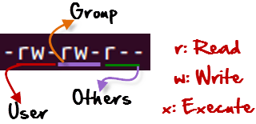

# Week two

> Open terminal and add the yellow flag to the right corner of your laptop 

## Cancel a running process

Sometimes an unwanted process happens in our terminal, perhaps we `cat` a really long file or we just insert a typo in the command line. We can simulate an unwanted process by just typing:

```
cat
```

You might think that the terminal is stuck, that we might have missed and argument for `cat`, but `cat`  is operating nevertheless. We can easily cancel the process by typing:

<kbd>control</kbd> + <kbd>c</kbd>

The process is canceled and the terminal is ready to receive a command.

## Command history

We can review all the latest commands typed recently easily by typing:

```
history
```

## Advance use of `cat` and looking inside files

`cat` can be used to print content of a file to the screen or to concatenate files. First, create a folder for today’s exercise and move into it:

```
cd Documents
mkdir week_2
cd week_2
```

We need to download a couple of files. We can download file with the command `wget`:

```
wget https://raw.githubusercontent.com/merlyescalona/ucsc-eeb-intro2comptools/master/week_02/data/genes_1.fas
wget https://raw.githubusercontent.com/merlyescalona/ucsc-eeb-intro2comptools/master/week_02/data/genes_2.fas
```

We can see the contents of the first file:

```
cat genes_1.fas
```

Wow! That is too much information to fit in the screen. `cat` will show all the content of the file and we won’t be able to interact with it.

You can use `more` to go through the file line-by-line by pressing <kbd>Return</kbd>. You can quit the program by typing <kbd>q</kbd>

```
more genes_1.fas
```

But, what if you want to navigate through all the content?  Different to `more`, we have `less`. This command will allow us to navigate through the file by going up and down, using the the arrow keys, the trackpad or the mouse.

```
less genes_1.fas
```

This looks better, the content shows up when you decide to, but what about the width of the content?

**Check the option `-S`. What does it do?  How would you look for this option if you don’t know?**

```
less -S genes_1.fas
```

For speed sometimes we would like to see only the first few lines of a file. `head`, as it name implies, it will allow us to check the first lines of a file. By default it will show the first 10 lines, but we can use the options of the command to ask for more or even less lines.

```
head genes_1.fas 
```

**Which option do you need to use to do this?**

If we use the `-` followed by a number, we will be able to ask for a specific number of lines. For example:

```
head -2 genes_1.fas 
```

`tail`, is the opposite of head, this command will give us the last lines of a file. In the same way of head, we can specify the number of lines that we want.

```
tail genes_1.fas 
tail -1 genes_1.fas
```

Finally, the other purpose of `cat` is to concatenate files. You can concatenate `genes_1.fas` with `genes_2.fas`

```
cat genes_1.fas genes_2.fas > genes_3.fas
```

We can check the concatenation was successful typing:

```
ls -lah
```

**What should I expect if the concatenation was successful?** 


As a reminder we can use wild cards `*` to facilitate things. I can concatenate all the `.fas` files by:

```
cat *.fas > genes_4.fas 
```

**Did it work?**

> Change your flag to green if you are good to continue 

# Standard I/O and redirection

> Change your flag to yellow  

Every Unix program starts out with three connections to the outside world. These connections are called ***streams*** because they act like a stream of information (metaphorically speaking):

  

Source: https://www.putorius.net/linux-io-file-descriptors-and-redirection.html
 
 
| Stream    Type |  Description                                                                                                                                          |
|----------------|-------------------------------------------------------------------------------------------------------------------------------------------------------|
| standard input | This is a communications stream initially attached to the keyboard. When the program reads from standard input, it reads whatever text you type in.   |
| standard output| This stream is initially attached to the terminal. Anything the program prints to this channel appears in your terminal window.                       |
| standard error | This stream is also initially attached to the terminal. It is a separate channel intended for printing error messages.                                |
 
The word "initially" might lead you to think that standard input, output, and error can somehow be detached from their starting places and reattached somewhere else. And you'd be right. You can attach one or more of these three streams to a file, a device, or even to another program. This sounds esoteric, but it is actually very useful. For example, when concatenating files as shown before.

## Pipe Operator

The pipe operator is used to pass the output of a command to the input of another command. The vertical bar (  <kbd>|</kbd>  ) represents this operator. The aptly named pipe can be thought of similar to a physical plumbing pipe which moves liquid from one vessel to another. Output from a command enters the pipe on one side and leaves the pipe as input for another command on the other side.

Once you have worked quite a while in your terminal, `history` will print a list that is too long to fit in your screen. You can combine `history` with `grep` using the "pipe" <kbd>|</kbd> character. `grep` is a program that looks for lines matching a string (a sequence of characters) and print those lines out.

Let's find the command that contain the string `cat` :

```
history | grep "cat"
```
`grep` could be very useful for obtaining rapidly useful information from a file.

Our `genes_1.fas` is a [FASTA](https://en.wikipedia.org/wiki/FASTA_format) file. You will see a header line with the sequence name preceded by the `>` character, the lines after this naming line is the DNA sequence. 

```
head genes_1.fas
```

Because there is only one `>` per sequence, we can infer the number of sequences in the file by counting how many times this character is present.

```
grep ">" genes_1.fas
```

We can combine pipe the output of `grep` with word count `wc` to calculate the number of sequences in our file

```
grep ">" genes_1.fas | wc -l
```

The option `wc -l` ask `wc` to only count the number of lines.

**What is the meaning of the output when `wc` is not given any options?**

```
wc genes_1.fas
```

> Change your flag to green if you are good to continue 


### Loops / iterative actions

> Change your flag to yellow  

In order to check if `cat` did a good job we need to ***count the number of lines for each file***, we type `grep “>” genes_1.fas | wc -l` four times changing the file name, but it seems obsolete and repetitive.

The solution is to employ a loop. A line of code that will iterate the same action over a list of files:

```
for arg in [list]
do
 command(s)...
done
```

We need somehow to convert `grep ">" genes_1.fas | wc -l` into a loop. Let’s start with the most basic loop:

```
for file in *.fas; do echo $file; done
```

`echo` simply prints the name of the file.  Cool, right! We can modify this simple loop to get closer to our solution, asking `grep` to only show the lines with the `>` character
 
```
for file in *.fas; do echo $file; grep ">" $file; done
```

We see that we are pretty close, we are printing the file name and every line that contains `>`. 

Now we just need to pipe the output of `grep` into `wc`

```
for file in *.fas; do echo $file; grep ">" $file | wc -l; done
```

Excellent!

Notice that there is also another solution to the problem:

```
for file in *.fas; do echo $file; grep -c ">" $file; done
```

One of the beauties of coding is that there can be several solutions to the same problem. Loops are really powerful and can be used to analyze/process many files with a single line of code.

> Change your flag to green if you are good to continue 

### Scripts

> Change your flag to yellow  

Simple commands and loops can be saved in a text file so they can executed later again. This is especially useful in science because your analyses can be easily replicated when you save your scripts. We can easily save the cool loop we just invented:

```
nano fasta_seq_counter.sh
```

Inside `nano` type

```
# Script that prints the number of sequences in a fasta file
for file in *.fas; do echo $file; grep -c '>' $file; done
```

Save the file.

Notice two things:

- The `#` is to “comment out” a line. When a `#` precedes a line the following text is not interpreted as a command.
- There should be a new line (<kbd>Return</kbd>) at the end of the last line to ensure the line is executed.

# Permissions and executing a bash script

Before executing the file we can check the permissions by typing:

```
ls -lah
```

Every file and directory in your UNIX/Linux system has following 3 permissions defined for all the 3 owners discussed above.

- Read: This permission give you the authority to open and read a file. Read permission on a directory gives you the ability to lists its content.
- Write: The write permission gives you the authority to modify the contents of a file. The write permission on a directory gives you the authority to add, remove and rename files stored in the directory. Consider a scenario where you have to write permission on file but do not have write permission on the directory where the file is stored. You will be able to modify the file contents. But you will not be able to rename, move or remove the file from the directory.
- Execute: In Windows, an executable program usually has an extension `.exe` and which you can easily run. In Unix/Linux, you cannot run a program unless the execute permission is set. If the execute permission is not set, you might still be able to see/modify the program code (provided read & write permissions are set), but not run it.




Going back to our file, We can see that it is not executable because it does not have an `x` in our permissions. We can change this by typing:

```
chmod +x fasta_seq_counter.sh
ls -lah
```

We can now execute our script:

```
./fasta_seq_counter.sh
```

Super cool! right?

> Change your flag to green if you are good to continue 

