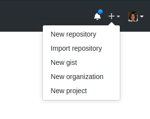
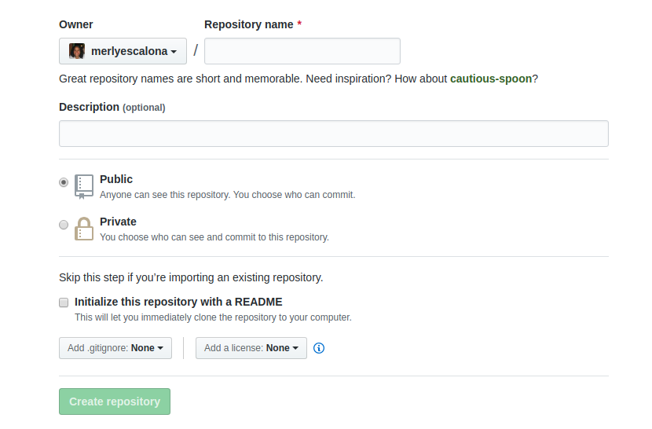

# Week three
## What is version control and why should we care?

Version control is a system (VCS) that records changes to a file or set of files over time so that you can recall specific versions later. 

###  Methods

| Method       | Graphic setup        | Tools                                     |
|--------------|----------------------|-------------------------------------------|
| Local        |   | [RCS](https://www.gnu.org/software/rcs/) |
| Centralized  |   | [CVS](https://www.nongnu.org/cvs/), [Subversion](https://subversion.apache.org/) |
| Distributed  |   | [Git](https://git-scm.com/), [Mercurial](https://www.mercurial-scm.org/) |

### Benefits

- A complete long-term change history of every file. 
- Branching and merging.
- Traceability

*Sources [Git](https://git-scm.com/book/en/v2/Getting-Started-About-Version-Control), [Attlasian](https://www.atlassian.com/git/tutorials/what-is-version-control)*

Why a VCS? Science is about repeatability and reproducibility. Similarly to making your genetic data available to GenBank, making you code available in a repository will make your science more accessible, with the added bonus of writing code in collaboration easily.

## Git - the stupid content tracker

Why Git? it is a Distributed VCS, it is more flexible and of course it is popular, and this means, more documentation and long term support in most cases. There are dozens of version control systems on the market, but some of the world's most renowned projects (like the Linux Kernel, Ruby on Rails, or jQuery) and several well known companies (Google, Facebook, Microsoft, Twitter, LinkedIn, Netflix) are using Git as their VCS of choice. 


## Git services 

Github and Bitbuckect are web interfaces of `git`, In the last years code-specific repositories have become popular among biologists. Github and Bitbuckect are the main platforms used. Both platforms offer a free accounts, but you can open an academic account with pro capabilities with your UCSC email.


Features for the basic type of accounts for each of the services: 

| GitHub                                                                                    | BitBucket 				                                                            | 
|-------------------------------------------------------------------------------------------|-------------------------------------------------------------------------------| 
| Unlimited repositories				                                                            | Unlimited private and public projects                                         |
| 3 collaborators/private repository			                                                  |  5 collaborators  			                                                      |
| [Education version](https://education.github.com/discount_requests/new) (Get account first then request access) | [Education version](https://bitbucket.org/product/education) (Get account first then request access) |


Demo Oscar’s or Merly’s repositories (current class is also a repository :wink:)

- https://bitbucket.org/oscarvargash/
- https://github.com/merlyescalona

> Change your flag to yellow


You can check if `git` is installed on your machine, open a terminal and type:

```
which git
```

`which` allows you to locate a command. When running `which`, we get back the pathname of the executable file of your command. If you get a path, that means your have it. If you don’t have you will need to install it.


# Installing git

## macOS

There are also a few ways to install `git` on macOS:
- A macOS `git` installer is maintained and available for download at the `git` website, at https://git-scm.com/download/mac.
- You can also install it as part of the GitHub for macOS install. Their graphical user interface (GUI) `git` tool has an option to install command line tools as well. You can download that tool from the GitHub for macOS website, at https://desktop.github.com.


## Linux 

```
sudo apt-get install git-all
```

## Windows 

There are also a couple of ways to install `git` on Windows:
- The most official build is available for download on the `git` website. Some of you already download it on [week_00](https://github.com/merlyescalona/ucsc-eeb-intro2comptools/tree/master/week_00#using-git-for-windows).
- Another easy way to get `git` installed is by installing GitHub Desktop. The installer includes a command line version of `git` as well as the GUI. You can download this from the [GitHub Desktop website](https://desktop.github.com/).


## Verify that your git installation was successful

Open the terminal and type: 

```
git --version
```

Configure your `git` username and email using the following commands. These details will be associated with any commits that you create:

```
git config --global user.name "Your name here"
git config --global user.email "your@email.here"
```

**NOTES**

- All the commands and processes that we are going to explain will work with any of the services that you decide to use. 
- The commands are a way of communication with the repository (`git`) independently of where they are hosted (stored).
- You do not need necessarily to create an account in any of the web services described above. You can keep track of your code locally (requires more work, since you are going to be the one managing it and maintaining it) but you can use any of the services to modify the project's code:
  - if you want your work to be publicly accessible (like your research)
  - if you want to work with a team (collaborators) 

# Creating a GitHub account

Go to https://github.com/ and sign up / create account / register.

***NOTE:*** For Github Education (later) go [here](https://education.github.com/discount_requests/new)

> Change your flag to green if you are good to continue 

# Hands-on

> Change your flag to yellow

Let’s remember our script from last class:

```
cd Documents/week_2
cat seqcounter.sh

# Script that prints the number of sequences in a fasta file
for file in *.fas; do 
  echo $file
  grep -c '>' $file
done
```

If you have erased the file create a new one (Hint: `nano seqcounter.sh`).

Now we are going to create a new folder with our script and sequence files to be synchronized with Github. Once the folder is created we can move our script inside, and change our location to be inside the folder:

```
mkdir test_repo
mv  seqcounter.sh test_repo/
cd test_repo
```

We need to download a couple of files (now that we have a nice internet connection!). We can download file with the command `wget`:

```
wget https://raw.githubusercontent.com/merlyescalona/ucsc-eeb-intro2comptools/master/week_02/data/genes_1.fas
wget https://raw.githubusercontent.com/merlyescalona/ucsc-eeb-intro2comptools/master/week_02/data/genes_2.fas
```

If you don't have `wget` you can download the files from the following links

https://www.dropbox.com/s/wbc0t1it7jmd3s9/genes_1.fas?dl=0

https://www.dropbox.com/s/yxjfg8otu1dr8ux/genes_2.fas?dl=0

We can use our script to get the number of sequences in these FASTA files. Make sure you can execute (run) your script (Hint: `ls -lh` and `chmod +x seqcounter.sh`).

```
./seqcounter.sh
```

Now that we have this working, we might want to do this in the future. We might also want to add more commands, and be able to track changes as we go. So we are going to make a repository out of this directory. We need to add some information about the script that we have so others (and the future us) can understand it. 

To do that we create a **`README.md` file**. This file will work as a manual and will give all the needed information about the respository and all repositories should have one. The `README.md` is a text file with markdown formatting. This kind of files are nicely interpreted by the web interface and they are shown directly to the reader. All lessons for this class are written in markdown. A manual for the *markdown* format can be found [here](https://help.github.com/en/github/writing-on-github/basic-writing-and-formatting-syntax).

Let's create a `README.md` file:

```
nano README.md
```

Insert the following text and save the file in `nano`:


```
# Fasta Sequence Counter

The script `seqcounter.sh` is bash script to be executed in Linux.

After cloning the repository please make sure the file is executable using `chmod +x seqcounter.sh` if necessary.

The script `seqcounter.sh` looks for FASTA files in the directory where it is executed and prints the name of the file and number of sequences.

```

> Change your flag to green if you are good to continue 

## Creating a repository

Now that we have our code and its corresponding documentation, we are now ready to create our repository. 

> Change your flag to yellow

Let’s start by going to the [GitHub web page](https://github.com/).

1. Sign in (if we are not already)

2. Go to your main page, and at the top-right corner click on the <kbd> + </kbd>:



3. Select "New repository".

4. Fill out the form. Keep in mind, that the name of the repository is going to be part of the URL that’s going to give access to your repository. So, try to make it descriptive (`seqcounter` can be an option here).



## Linking repositories

Now that your repository has been created on the GitHub server, we need to link your local folder with GitHub. First, we need set up our folder as a repository and then link it. In your terminal type:

```
git init # This is a one-time command
git remote add origin https://github.com/YOURUSERNAME/seqcounter.git
```

Now we can verify that it worked:

```
git remote -v
```

Now that we have linked our local files with the repository we can synchronize our files.  But first, let’s try to understand how to work with `git`. 

**Staging, commit, and you**. One of the most confusing parts when first learning `git` is the concept of staging environment and how it relates to a *commit*. A ***commit*** is a record of what files we have changed since the last time we made a commit. Essentially, we make changes to the repo (for example, adding a file or modifying one) and then tell `git` to put those files into a ***commit***. Commits make up the essence of our project and allow us to go back to the state of a project at any point.

So, how do we tell `git` which files to put into a commit? This is where the staging environment comes in. When we make changes a the repo, `git` notices that a file has changed but won't record or do anything with it (like adding it in a commit).

To add a file to a ***commit***, you first need to add it to the staging environment. To do this, we can use the `git add <filename>` command or we can add all the files. Remember the wildcard `*`?

```
git add *
```

We’ve added all the files we want to the staging environment, then we can commit all changes adding also a comment of what we did with the option `-m`. If we decide not to add any comment in the same line (or we forget), `git` will either complain or it will automatically open an editor (i.e. `vim`, `nano`) and allow us to add a comment. It won’t accept being left empty.

```
git commit -m “initial push”
```

In future synchronizations `“initial push”` can be replaced by things like `“fixed bug in code”` or `“edited text”`, these comments will accompany the version of your files and will help to keep track of the changes being made. 

Finally we can update our remote GitHub repository with:

```
git push -u origin master
```

> Change your flag to green if you are good to continue 

We can now go to the online repository and see all our files there. We can see how GitHub has interpreted our `README.md` file. Congratulations, you have created your first repository! :tada:

When you collaborate or make changes on-line your local files are going to be out of date. Before starting working on your local files make a `git pull` to make sure you up to date.

> Change your flag to yellow

Here is an example. First, on GitHub, click on the `seqcounter.sh`, you can see all your code on-line. Then click on the :pencil2: at the top right of the text window. You can now edit the script on-line. Add the following line to the end of the script:

```
echo done
```

This line will print `done` once the code had run (a nice touch that helps for debugging), but now our local files are out to date, we can check this with:

```
git remote update
git status -uno
```

now  we can pull the changes into our local files:

```
git pull
```

You can now work locally and then update changes. Remember the holy trinity of commands for git:

```
git add *
git commit -m “YOUR COMMENT”
git push 
```

> Change your flag to green if you are good to continue 
