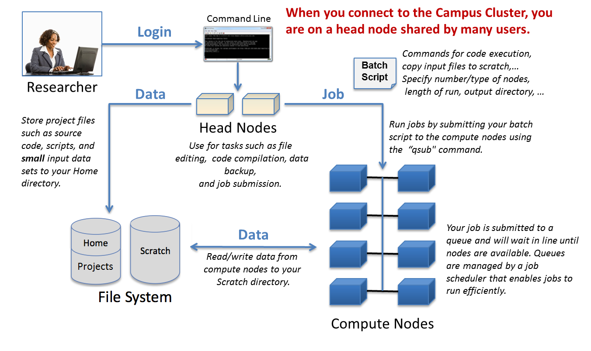
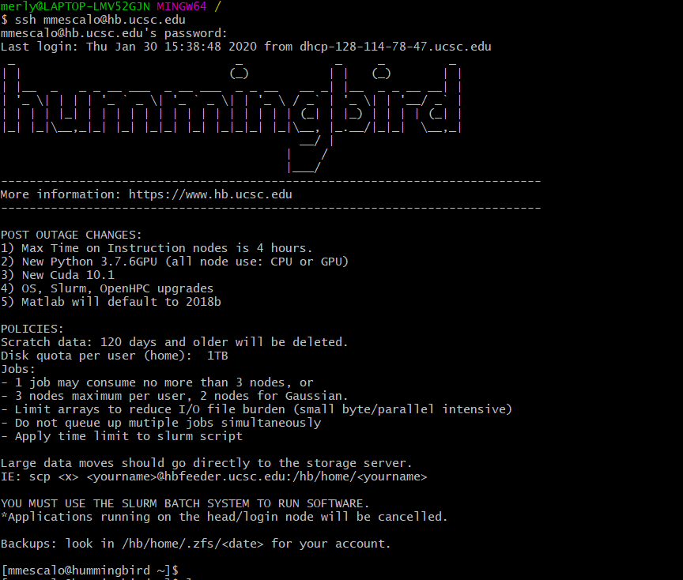

# Week 4: Hummingbird

## High performance clusters (HPCs)

A computer cluster refers to a group of computers that are working together on a similar task. The two main reasons for using them are:

- To improve performance or throughput 
- To improve uptime by providing a backup computer in case the primary computer fails.

HPCs/computer cluster systems will typically have a large number of computers (referred to as **nodes**).  There are two primary types of nodes on a cluster:

- ***Compute nodes***: these are the majority of nodes on a cluster and are the nodes that run user jobs.
- ***Head nodes***: one or more on a cluster and where you login from your local computer (laptop/desktop). 

In general, the ***compute nodes*** would be configured identically but they could also be grouped in ***partitions*** which will have nodes with similar features (i.e. nodes with more processors, more RAM, GPU access, etc...). In order to manage their resources, the clusters have a scheduling software. The most popular are SLURM (Simple Linux Utility for Resource Management) and SGE (Sun Grid Engine). SLURM is the one *hummingbird* uses so we will focus on this for all our examples.

### Overview



*Source: [University of Illinois - Campus Cluster](https://campuscluster.illinois.edu/resources/docs/start/)*


### Hummingbird 

*Hummingbird* is the UC Santa Cruz campus open access computational cluster.  It has a number of preinstalled software packages that are used in the sciences and engineering.  The cluster can also be used for other applications in Social Sciences, Humanities and Arts.  Many users compile software themselves in their home directories, this is useful for those who want to run a specialized environment. All the details of our cluster system can be found [here](https://www.hb.ucsc.edu/).

General specifications:

- 788 cores (500 Intel cores/288 AMD - 6000 Series cores)
- 1 GPU node that consist of 24 cores/96GBs RAM and 4 Telsa P100 GPUs
- There is a ZFS storage back end for the home directories of approx. 200 TBs
- There is a maximum of 3 nodes per single job
- Modules software environment
- High speed networking interfaces (10 Gbps)


## Access

If you have access to a UCSC account, then you can connect to *hummingbird* via `SSH` (secure shell) client. Where do I get this `ssh` from? On Linux and/or macOS, `ssh` command is almost always pre-installed. Open a terminal and type `which ssh` or `ssh --help` to check if that is the case. If you are using Windows, you can use the same command on Git bash or you can download a client with a GUI like [putty](https://www.putty.org/) or [MobaXterm](https://mobaxterm.mobatek.net/)

The access information you will need for any `ssh` client:

- **Host**: `hb.ucsc.edu`
- **Username**: `<cruzid>`
- **Password**: BLUE password
- **Port number (if required)**: `22`

> Set your flag to yellow 

You can connet to *hummingbird* using the following command 

:warning: Change the `<cruzid>` with your own :warning:

```
ssh <cruzid>@hb.ucsc.edu
```

Alternatively, you can use:

```
ssh -l <cruzid> hb.ucsc.edu
```

The first time you log-in from your computer, the system is going to ask you something like this:

```
ECDSA key fingerprint is SHA256:KcHtFaqEBK9+miuXd09ly+UC8mrxPLh2Eswo0dxWM0A. Are you sure you want to continue connecting (yes/no)?
```

Just type:

```
yes
```
 
Once connected, you will see something like this: 



**Connecting to *hummingbird* off-campus**: If you are off campus, you will be required to use Campus VPN to connect to *hummingbird*.  There is no need to request an account for the Campus VPN. To install the VPN client to your machine, all you need to do is follow the [VPN Installation Instructions](https://its.ucsc.edu/vpn/installation.html).

> Change your flag to green if you are good to continue 

Now you are on operating in a new computer. We can see which files are in our `home` folder by:

```
ls
```

There is nothing! What about if we reveal hidden files?:

```
ls -a
```

Now, we can see that there are some configuration files.
 
Let’s upload the folder we used last class. To upload a folder or a set of files we will open a second terminal window. In the terminal you can do this easily by:

<kbd>command</kbd> + <kbd>n</kbd>
 
First, we go to the `test_repo` folder:

```
cd Documents/week_2/test_repo
```

We are going to modify a bit our script so it produces an output:

```
nano seqcounter.sh
```

Copy and paste the modified script in to `nano` and save. Can you tell what the difference is and what it does?

```
#script that prints the number of sequences in a fasta file
for file in *.fas; do echo $file >> results.txt ; grep -c '>' $file >> results.txt; done
 
echo done
```

If you erased the files, don’t worry. We gotcha, just download the folder from here:
https://www.dropbox.com/sh/xykducoziqn27wo/AAAUym4glo9MaVlJuYG9cjnua?dl=0

> Change your flag to green if you are good to continue 

We are going to upload the folder `test_repo` with the idea of executing our script in *hummingbird*.
In the terminal window navigating your local computer place yourself in the parental directory of `test_repo`
 
> Change your flag to yellow 
 
```
cd ..
```
 
Moving files to your *hummingbird* account requires the use of  a secure file transfer program. To do this you can:

- Use a GUI Client, and one of the best applications for this is [Filezilla](https://filezilla-project.org/) it is available for MacOS, Windows and Linux. You will only need to remember the [access information](#access). 
- Or, use the `scp` command to copy files to and from HB from your computer’s terminal application, this command is similar to `cp` but it is used for copying files between computers. 
    
We are going to use `scp`. The basic usage of `scp` is `scp origin destination`; where origin and destination are `PATHS` of your computer or of the server.

If we are referring to a file from our computer we would have something like this: `/home/user/myfile.txt`. If we are referring to a file on a remote server, we need a little bit more information to be able to identify the file we want or the folder where we want to copy our local file to: `USER@hb.ucsc.edu:/hb/home/myfile.txt`. **Remember** that *hummingbird* will ask for your BLUE password.

Let's transfer our `test_repo` folder to the cluster:

:warning: Change the `<cruzid>` with your own :warning:

```
scp -r test_repo/ <cruzid>@hb.ucsc.edu:/hb/home/<cruzid>
```
 
We need to test that the upload worked. Go to your terminal window connected with *hummingbird*:
 
```
ls
cd test_repo
ls -lah
```

Do you think we can execute this file?
 
> Change your flag to green if you are good to continue 
 
Now that we know how to access *hummingbird* and how to transfer data to *hummingbird*, let’s try to understand how to work on it. As in any language, there’s some slang we need to get used to. Every script that we create to work on *hummingbird* we will also call it ***command file*** ; the process of executing the command file is called ***submitting a job*** and when the command file has been submitted and it is either waiting resources to run or running, we will call it ***job***.

In *hummingbird*, or rather in SLURM, we have 2 different ways of submitting jobs:

- **`srun`**,  used to submit a job for execution in real time. The `srun` command is designed for interactive use, with someone monitoring the output. Use of `srun` on *hummingbird* requires the allocation of resources first making use of the command `salloc`. We are not going to get into more details about this submission method, but if you want to know more, go to the [*hummingbird* web site](https://www.hb.ucsc.edu/getting-started/) or you can check the [***Resources*** page](https://github.com/merlyescalona/ucsc-eeb-intro2comptools/blob/master/resources.md).
- **`sbatch`**, used to submit a job script for later execution. The `sbatch` command is designed to submit a script for later execution and its output is written to a file. Command options used in the job allocation are almost identical, the difference is that we either write them down in the script or we define them in the command line. Executing jobs in *hummingbird* requires a command file specifying the resources necessary to execute the job. These configurations depend on the program being executed and the amount of data being processed. For the sake of learning we will create a command file and submit our job to a queue. 

> Change your flag to yellow 

Let’s create a file:

```
nano job.mpi
```

Copy and paste the following text:  

:warning: make the necessary changes (`<cruzid>`) :warning:

```
#!/bin/bash
 
#SBATCH -p Instruction   # Partition name
#SBATCH -J test		# Job name
#SBATCH --mail-user=<cruzid>@ucsc.edu
#SBATCH --mail-type=ALL
#SBATCH -o job%.j.out	# Name of stdout output file
#SBATCH -N 1		# Total number of nodes requested (128x24/Instructional only)
#SBATCH -n 1		# Total number of mpi tasks requested per node
#SBATCH -t 0:10:00  # Run Time (hh:mm:ss) - 1.5 hours (optional)
#SBATCH --mem=1G # Memory to be allocated PER NODE
 
export OMPI_MCA_btl=tcp,sm,self
 
# Use of -p replaces the need to use "#SBATCH --cpus-per-task"
 
./seqcounter.sh
```

Exit `nano` and save the file. Now we are ready to submit our job (execute it):

```
sbatch job.mpi
```

Cool! We can check the status of the job with:

```
squeue
```

We can be more specific and only look for our tasks:

```
squeue -u ovargash
```

Congratulations :tada:! You have run a job in *hummingbird*!

### Exercise 1

How would you copy the `results.txt` file to your local computer?

> Change your flag to green if you are good to continue 

## Things to keep in mind:

> Change your flag to yellow 


You can get a list of the installed programs, organized as modules, in:

```
module avail
```

If you need a program that is not there, you can ask the staff at *hummingbird* to install programs for you.

In order to use a program from the list, you need to load the module it belongs to. You can load a module with:

```
module load fastqc
```

If you have loaded some modules, you can see which modules are loaded by using:

```
module list
```

### Exercise 2

Knowing that you can analyze raw sequencing data (FASTQ files) with the command `fastqc -o fastqc_out *.fastq*`, create a SLURM file to analyze the `.fastq.gz` files provided in the following link:

https://www.dropbox.com/sh/xykducoziqn27wo/AAAUym4glo9MaVlJuYG9cjnua?dl=0


> Change your flag to green if you are good to continue 

### Storage

In *humminbird*, there are 3 different areas of storage, with their specifications.

- `/hb/home`: where your home directory lives- quota 1TB
- `/hb/groups`  assigned as request for groups, e.g. courses
- `/hb/scratch`: best place to use for your data – no quota, no backup

### Partitions and constraints

Cluster nodes are grouped into partitions, and various scheduling parameters are associated with those partitions. You can control what partition, and how many nodes/tasks are selected, but not how resources are scheduled. You have control over CPU resources (high level) and memory usage. The designation of some of these features in our command files are optional. Therefore, it is highly advised to optimize cluster use. ***Always try to adjust the available resources,  as much as you can,  to the real requirements of your job.*** 

To know the particularities of each partition and the corresponding constraints, please check Section "HB Partitions and HB SLURM constraints" [here](https://www.hb.ucsc.edu/getting-started/).


## Other very important considerations

1. Hummingbrid is not mean to be a place to store your files. Use your home directory only for scripts and command files. Try to storage the heavy load of your data or the temporary files generated by your analyses on  the scratch directory instead. Download your results and have a local copy of everything.

2. `home` has limited storage while `scratch` does not. You might want to run all analysis in `scratch`, but be awared that `scratch` is routinely flushed.

3. Ask for help if need it :). If you are stuck or don't know how something works ask someone who has run a similar analysis, alternatively ask hummingbird staff, they are always willing to help.
